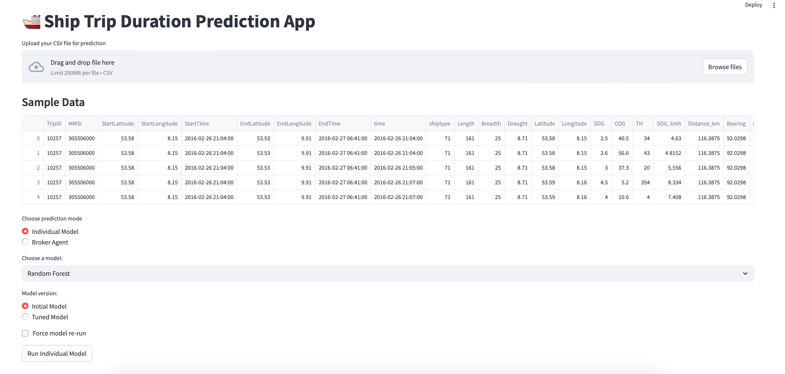

# ⛵ Expected Travel Time Prediction for Vessels  
**Group 4 — Kateryna Makarova**

A powerful and interactive Streamlit application for predicting vessel ETA (Expected Time of Arrival) based on AIS data using multiple machine learning models and integrated analytics.

---

## 🚀 Project Overview

This project leverages AIS data to **predict the remaining travel time of vessels** between **Bremerhaven and Hamburg**, a critical application in maritime logistics.

📌 **Key Benefits**:
- Supports **port operations**, scheduling, and traffic management
- Automatically processes raw AIS datasets
- Predicts and maps ETA in real-time for any given ship position
- Offers in-depth **error diagnostics**, visualization, and interpretability

---


## Outtakes


📄 [Project Report (PDF)](docs/Predicting%20Expected%20Travel%20Time%20(ETT)%20Using%20AIS%20Data.pdf) &nbsp;&nbsp;&nbsp; 🎬 [Watch Demo (MP4)](docs/LiveDemoVideo.mp4)


## ⚙️ Machine Learning Models

The app includes multiple ML regression models to predict travel time (tuned/not tuned). Here are the tuned models.

| Model                        | Hyperparameter Tuning | Script                         |
|-----------------------------|------------------------|--------------------------------|
| Linear Regression           | No                     | `linear_regression.py`         |
| Random Forest               | Yes (`RandomizedSearchCV`)   | `random_forest_with_cv.py` |
| Gradient Boosting Regressor| Yes (`RandomizedSearchCV`)   | `gradient_boosting_with_cv.py`   |
| MLP Regressor               | Yes (`GridSearchCV`)  |  `mlp_regressor_with_cv.py` |

💡 **Model logic and broker agent integration** handled by: `broker_agent.py`

✅ Models are versioned, cached, and reloaded automatically unless “Force model re-run” is enabled.

---

## 📥 Workflow: Data Upload & Cleaning

Upload your own AIS `.csv` file or use the default Hamburg ↔ Bremerhaven data.

🧹 **Cleaning logic handled by `cleaning.py`:**
- Validates essential columns
- Parses time fields and numeric coercion
- Imputes ship-type-specific missing values
- Removes physical outliers (e.g. Length > 400m)
- Converts SOG to km/h and caps unrealistic speeds
- Computes route-based features

A file hash is used for efficient caching. No reprocessing happens unless the file changes.

---


### 📋 Required Input Columns

#### For `cleaning.py` (raw AIS data preprocessing):

The input CSV file should contain the following columns:

* `MMSI`: Unique vessel identifier
* `Latitude`: Vessel's current latitude
* `Longitude`: Vessel's current longitude
* `COG`: Course over ground (in degrees)
* `SOG`: Speed over ground (in knots)
* `time`: Timestamp of the AIS message
* `ShipType`, `Length`, `Width`, `Draught` (optional but recommended for better predictions)

> ℹ️ Additional columns may be present, but only the above are required for cleaning.

#### For location prediction and visualization:

Your file (after cleaning) must include these columns:

* `Latitude`: Starting latitude
* `Longitude`: Starting longitude
* `SOG_kmh`: Speed over ground converted to km/h
* `COG`: Course over ground (in degrees)
* `TripID`: Unique identifier for each journey
* `time`: Start timestamp of the journey

---

## 🔢 Feature Inputs

| Feature    | Description               |
|------------|---------------------------|
| `shiptype` | Numeric vessel type code  |
| `Length`   | Vessel length in meters   |
| `Draught`  | Draught in meters         |
| `SOG_kmh`  | Speed over ground (km/h)  |
| `COG`      | Course over ground (°)    |

🎯 **Target**: `ETA_hours` – Remaining travel time from the current row.

---

## 🧠 Prediction Modes

1. **Default mode**: Use built-in cleaned data and pretrained models  
2. **User upload**: Upload custom route and make predictions live  

You can choose between Individual Models (tuned/not tuned) as well as use a broker agent for which you need to determine model weights. 

All files with prediction results available for download.
---

## 🗺️ Visualizations & Maps

- **Red markers**: Predicted future ship locations  
- **Blue markers**: Historical positions  
- **Hover tooltips**: Show ETA & predicted arrival datetime
- **Error analysis**: Error distribution and heatmap 

📌 **Powered by `plotly.graph_objects`**

---

## 📊 Error Diagnostics (`prediction_analysis.py`)

Run **Show Predicted Error Analysis** directly in the app!

✅ Trigger via:
```python
st.button("Provide error Metrics")
```

Includes:

| Feature                              | Description                                |
|--------------------------------------|--------------------------------------------|
| 🔹 Summary statistics                | Mean, Median, Max, Min, 75th percentile    |
| 🔹 Tabular view of detailed errors   | With actual/predicted/abs error info       |
| 🔹 Distribution plot                 | Histogram of prediction errors             |
| 🔹 Heatmap of spatial error          | Colored by absolute error (Lat/Lon space)  |

🖼️ Plots can be saved by clicking on plots or found in /analysis_outputs.

---

## 💾 Storage Strategy

Efficient storing logic:
- Uses filename + model name/version as a  key
- Saves `.joblib` models and predictions
- Force retraining available for debugging and analysis

Saved in /cache, which is just a permanent storage and does not have traditional "caching" functionalities.
---

## 📂 File Structure

| File/Script                     | Purpose                              |
|--------------------------------|--------------------------------------|
| `main.py`                      | Streamlit interface and logic        |
| `broker_agent.py`              | Broker Agent  Implementation         |
| `prediction_analysis.py`       | Post-prediction error diagnostics    |
| `cleaning.py`                  | Data validation and transformation   |
| `geospatial_utils.py`          | Feature engineering (distance, bearing) |
| `mlp_regressor*.py`etc.        | Model definitions                    |
| `/cache/`                      | Permanenttly saved model and prediction files |


---

## 🐳 Run with Docker (Recommended)

```bash
docker build -t vessel-eta-app .
docker run -p 8501:8501 vessel-eta-app
```

Visit: [http://localhost:8501](http://localhost:8501)

---

## 🖥️ Run Locally

```bash
python3 -m venv venv
source venv/bin/activate     # Windows: venv\Scripts\activate
pip install -r requirements.txt
streamlit run main.py
```

---

## 🏁 Future Enhancements (Optional)

- ❓ **Model interpretability** (e.g. SHAP)
- ⏱️ Real-time data integration
- 🧪 Cross-validation dashboard

---

## Results

✔️ Data cleaning pipeline  
✔️ Modular model architecture  
✔️ ML performance comparison  
✔️ Map + prediction visualization  
✔️ User upload and manual input  
✔️ Caching and retraining logic  
✔️ Post-analysis module with plots